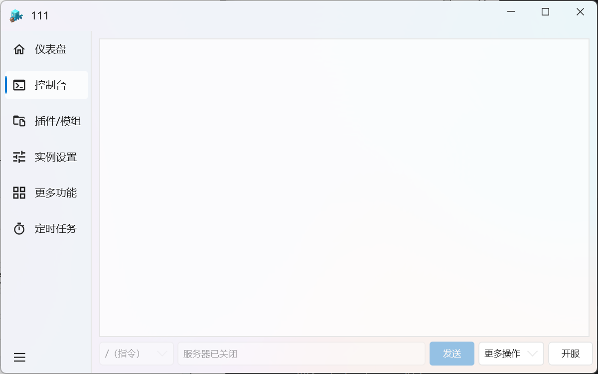
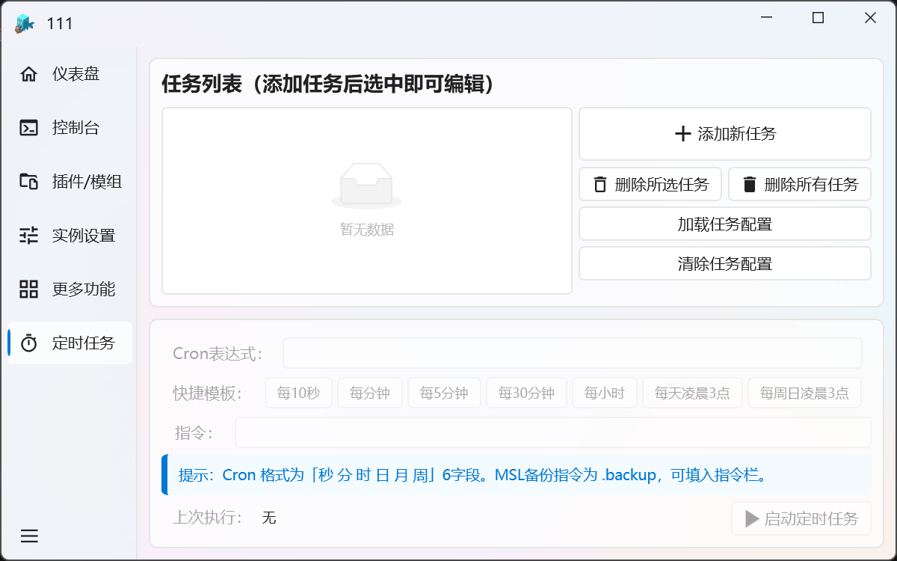
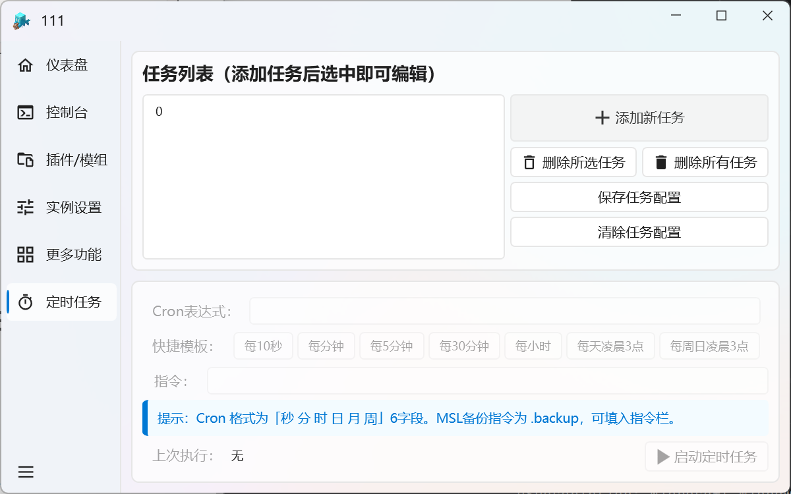
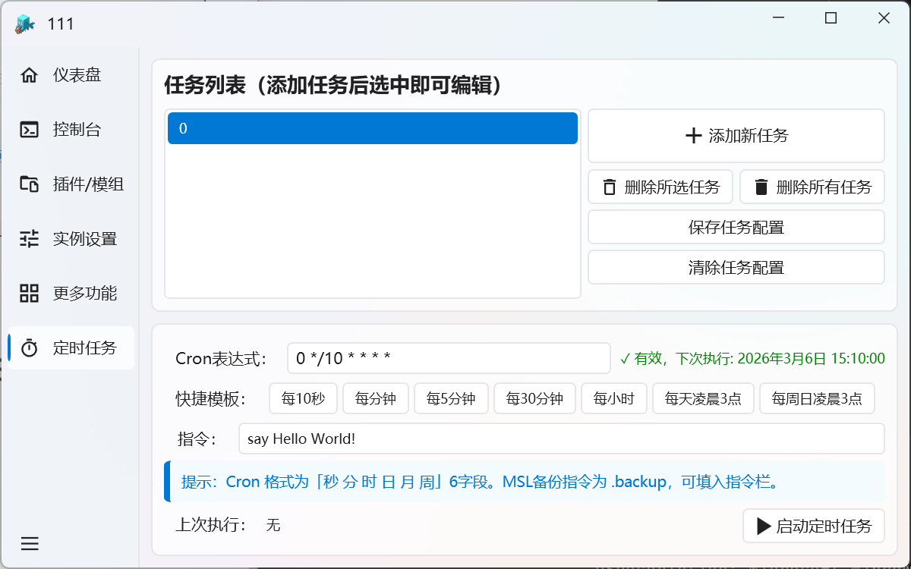
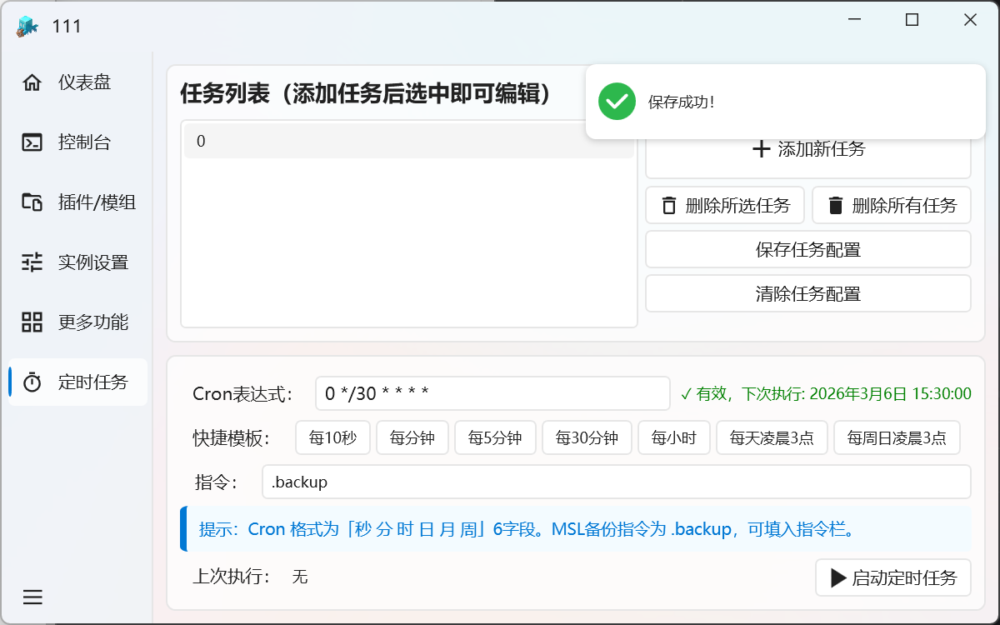

# 服务器备份

## **手动备份**

手动备份在右下角的==更多操作==按钮，点击就能看见备份按钮

## **自动备份**

左侧点击==定时任务==

第一次进来应该是和上方图片一样，我们需要以下步骤：
:::: steps

1. ### 点击添加新任务

     

2. ### 点击任务列表中的任务

     

3. ### 在下方设置时间和指令.backup，并点击右侧的保存任务配置 （这里使用的是cron表达式定时）

     

4. ### 最后点击右下角的启动定时任务

如果设置完之后重启软件就没有了，请点击加载任务配置

需要注意的是，你需要先选中任务列表的任务，再点击右下角的启动定时任务才能开启自动备份
